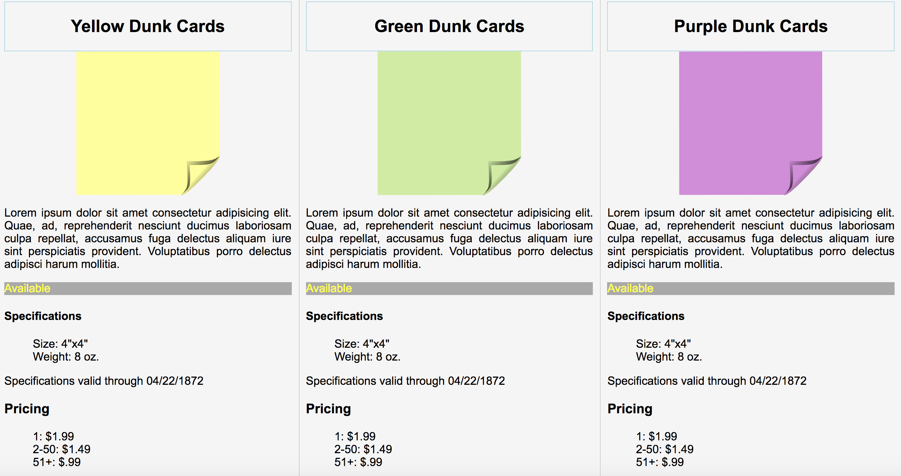

# Product Card Webpage Readme

### About this project
<p>This project was intended to get us into the practice of building basic cards in
HTML.  Each product card needed to be it's own div, contain specific product details, and be styled a certain way using CSS. </p>

<br>

### Class Instructions for this project
<a href=https://github.com/nss-nightclass-projects/exercise-vault/blob/master/HTML_CSS_product_cards.md>The Static Web HTML+CSS</a>

<br>

### How To Use
```
1. Install `http-server` from `http://www.npmjs.com/package/htt-server`
2. In Terminal, navigate to the project folder and type: `http-server -p 8080`
3. In your browser, navigate to `http://localhost:8080`
```
<br>

### Screenshot


